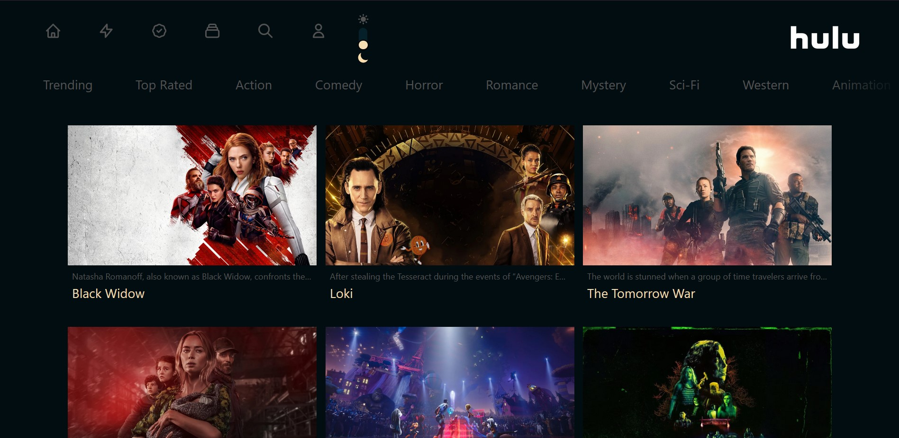

# HULU-like app.



## Description
Nextjs(typescript) app .
Listing movies from tmdb API's .
Cool css , responsive and night mode available.
Live demo can be found in https://list-clone.vercel.app/

## Technologies & Tools

* React
* NextJS
* Redux
* TailwindCSS
 

### Steps:
1. Clone repo on your local machine:
```
git clone git@github.com:Da3az/list-clone.git
```
2. Install dependencies:
```
$ npm install
```
3. Create .env file and enter your tmdb api key
```
API_KEY = **********************
```
4. Execute the app:<br/>
```
$ npm run dev
```
5. App now running on ```localhost:3000```

